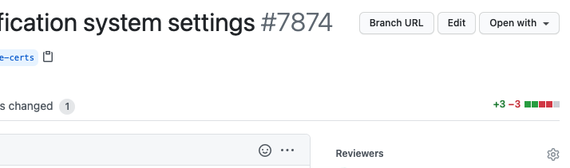

# github-branch-to-url

A Chrome extension that allows adding a custom URL link to GitHub pull request pages.

### Screenshot

### License
This software is licensed under the [MIT License](https://github.com/elgaspar/github-branch-to-url/blob/master/LICENSE).